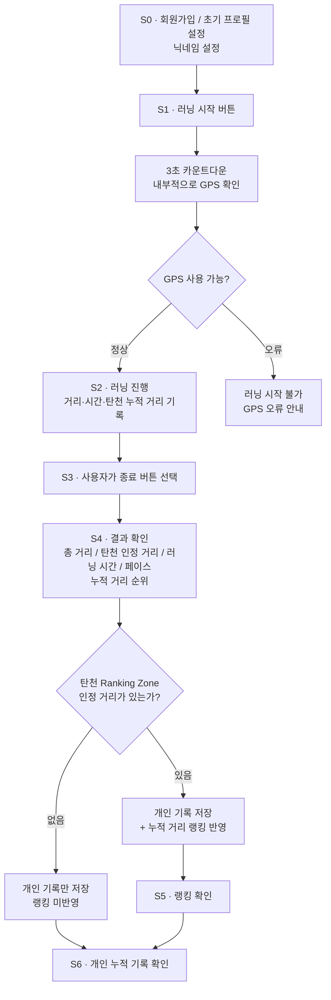

# 업무 분석 — 탄천 로컬 개인 랭킹전

> 문서: 02-workflow.md · 상태: 확정 · 열린 질문 [?] 0개 · 채택한 [제안] 0개 · 마지막 갱신: 2026-09-09
> 이 문서를 읽는 에이전트에게: 여기 없는 것은 지어내지 말고 질문으로 돌려라.
> 이 문서는 MVP 기준 핵심 사용자 흐름만 다룬다.

---

## 행위자

| A  | 이름    | 역할                          | 한 줄 상황                                                                                                                                        | 지금 쓰는 도구              |
| -- | ----- | --------------------------- | --------------------------------------------------------------------------------------------------------------------------------------------- | --------------------- |
| A1 | 탄천 러너 | 서비스의 일반 사용자                 | 성남 탄천 및 주변 지역에서 달리며 개인 러닝 기록을 관리한다. 탄천 Ranking Zone 안에서 달릴 경우 주변 러너들과 누적 거리로 경쟁하고, 랭킹에 관심이 없는 경우에도 자신의 거리·시간·페이스 기록을 누적하여 이전의 자신과 비교한다. | NRC, Strava, 스마트폰 GPS |

> 주: S0의 To-Be에 닉네임 설정 흐름을 추가했다 — 03-requirements.md R33·04-features.md F30 신설에 따른 반영(팀 확정 내용 그대로). 이후 "자동 랜덤 생성" 부분은 팀 결정으로 후순위 전환되어 "가입 시 직접 설정(필수)"만 남도록 다시 단순화했다.
> 주: S4의 "평균 페이스", S6의 "지난주·지난달 비교"는 팀 결정으로 후순위 전환되어 To-Be 문구와 mermaid에서 제거했다 (03 R34·R22~24, 04 F31·F22~23 참고).
> 주: A2(관리진)는 팀 결정으로 제거되었다 — "A2의 역할이 MVP 시점에 중요하지 않아 빼도 괜찮다." Ranking Zone 좌표는 시스템에 사전 설정되어 있는 것으로 취급하며, 설정 주체는 이 문서 범위 밖이다. 04-features.md F8, 05-policy.md P8·SP5가 A2를 참조하고 있어 해당 문서에서도 함께 정리했다.
> 주: 팀의 MVP 재축소 결정으로 목표 거리·시간 설정(S0)·종료 확인 메시지(S3)·주간·월간 랭킹 구분(S4·S5)까지 후순위로 뺐다. 주간·월간 랭킹 구분(및 종료 확인 메시지)은 03·04·05에도 이미 반영되어 있었고, 목표 거리·시간 설정만 반영이 늦어져 있었다 — 2026-09-10에 03(R1~R4)·04(F1~F4)·05(P1)까지 후순위 전환을 마쳐 이제 02와 어긋나는 부분 없이 일치한다.
> 주: (2026-09-10 추가 정리) A1 행위자 설명과 S5 To-Be 문장에 남아있던 "주간·월간" 언급을 마저 지웠다 — S4의 "평균 페이스"·S6의 "지난주·지난달 비교"를 본문에서 지웠던 것과 같은 기준으로, 이미 후순위 전환된 항목은 본문 서술에서도 완전히 빼기로 한다. 05-policy.md의 상태값·SP1에도 같은 기준을 적용해 정리했다.
> 주: S4에 페이스를 다시 추가했다 — 팀 원문 "페이스는 거리와 시간 같은 예외 사항 신경쓰지 않고 무조건 속력만 표시." 거리 0 처리, GPS 끊김 등 다른 항목들이 갖는 예외 로직을 페이스에는 적용하지 않고 단순 속력값만 보여준다.
> 주: 실시간 갱신 원칙 — 러닝 중에는 거리·시간이 실시간으로 갱신되지만, 순위는 실시간으로 갱신되지 않는다(러닝 완료 후 결과 화면·랭킹 화면에서만 확인 가능). S2의 실시간 표시(거리·시간·탄천 인정 거리)와 S4·S5의 순위 확인을 혼동하지 말 것.

---

## 단계 (As-Is → To-Be)

| S  | 단계                      | 행동(As-Is)                                                    | 감정                                           | 불편                                                                              | To-Be 한 줄                                                                                                              |
| -- | ----------------------- | ------------------------------------------------------------ | -------------------------------------------- | ------------------------------------------------------------------------------- | ---------------------------------------------------------------------------------------------------------------------- |
| S0 | 회원가입 · 초기 프로필 설정        | 기존 러닝 앱에 가입한 뒤 러닝 목표는 사용자가 매번 직접 판단하거나 별도로 설정한다.             | 빠르게 러닝을 시작하고 싶지만 자신에게 맞는 목표는 유지하고 싶다.        | 매 러닝마다 목표 거리와 목표 시간을 다시 입력하는 것은 번거롭다.                                           | 카카오·구글 등 소셜 로그인으로 가입한다. 가입 시 **닉네임**을 직접 설정한다(필수). 닉네임은 다른 사용자와 중복될 수 없다.                            |
| S1 | 러닝 시작                   | 기존에는 NRC·Strava 등에서 시작 버튼을 누르고 러닝 기록을 시작한다.                  | 출발 전 자세와 페이스를 준비하며 러닝을 시작하려 한다.              | GPS 신호 확보나 기술적인 로딩 과정을 그대로 기다리는 것은 러닝 시작 흐름을 끊는다.                               | **러닝 시작 버튼 → 3초 카운트다운 → 러닝 시작** 흐름으로 제공한다. 카운트다운 동안 시스템은 내부적으로 GPS 상태를 확인하며, GPS를 사용할 수 없으면 러닝을 시작하지 않고 오류를 안내한다.      |
| S2 | 러닝 진행                   | 사용자는 달리면서 거리·시간·페이스를 확인한다.                                   | 목표를 향해 달리면서 현재 기록과 탄천에서의 성과가 궁금하다.           | 러닝 도중 기록을 보기 위해 계속 휴대폰을 확인하면 집중을 방해하지만, 필요해서 화면을 봤을 때 핵심 정보가 없다면 현재 상태를 알기 어렵다. | 러닝 중 화면에는 **현재 러닝 거리·러닝 시간·탄천 인정 누적 거리 등 주요 정보**를 표시한다.                                               |
| S3 | 러닝 종료                   | 기존 러닝 앱처럼 사용자가 러닝을 끝낸 뒤 직접 기록을 종료한다.                         | 목표한 러닝을 완료했다는 성취감을 느낀다.                      | 자동 종료나 일시정지 판정이 개입하면 사용자가 의도하지 않은 시점에 세션이 나뉠 수 있다.                              | MVP에서는 **사용자가 종료 버튼을 직접 눌러 러닝을 종료**한다. 자동 종료와 일시정지는 제공하지 않는다.                                                          |
| S4 | 결과 확인 · Ranking Zone 판정 | 기존 서비스에서는 전체 러닝 거리·시간·페이스 등의 개인 기록을 확인한다.                    | 완주 기록과 함께 탄천에서 자신의 성과가 어느 정도인지 확인하고 싶다.      | 전체 러닝 기록만으로는 실제 탄천 랭킹에 어느 정도가 반영되었는지 알기 어렵다.                                    | 러닝 종료 후 **총 러닝 거리, 탄천 인정 거리, 러닝 시간, 누적 거리 기준 순위, 페이스**를 보여준다. 전체 러닝은 개인 기록으로 저장하고 Ranking Zone 안에서 측정된 거리만 랭킹에 반영한다. |
| S5 | 랭킹 확인                   | 기존 러닝 서비스의 전국·글로벌 단위 기록 비교는 내가 실제로 자주 뛰는 지역에서의 위치를 체감하기 어렵다. | 주변에서 비슷한 코스를 달리는 러너들과 경쟁하며 성취감과 동기부여를 얻고 싶다. | 전체 사용자 기반 경쟁에서는 현실적인 경쟁 상대와 자신의 위치를 파악하기 어렵다.                                   | 탄천 Ranking Zone의 **누적 거리 기준 순위(TOP 100 캡·100위 밖 별도 표시)**를 제공한다.                  |
| S6 | 개인 누적 기록 확인             | 기존에도 자신의 과거 러닝 기록을 확인할 수 있지만 기록이 단순한 숫자 목록으로 남는 경우가 많다.      | 다른 사용자와의 경쟁보다 자신의 성장을 확인하고 싶은 사용자도 있다.       | 탄천 밖에서 주로 달리거나 랭킹에 관심이 적은 사용자는 로컬 랭킹만으로 지속적인 동기부여를 얻기 어렵다.                      | Ranking Zone 여부와 관계없이 **개인 러닝 기록을 계속 누적하여 확인할 수 있게 한다.**                          |

---

## 흐름

---

## 검토했으나 제외

| 후보                | 출처(누구 초안 · [제안])           | 제외 이유                              |
| ----------------- | ----------------------- | ---------------------------------- |
| 통산 랭킹             | 02 논의                   | 제외 — MVP에서는 주간·월간 경쟁에 집중           |
| 개인 티어·레벨 시스템      | 02 논의                   | 후순위 — 게임화 확장 기능                     |
| 자동 종료             | S3                       | 후순위 — MVP에서는 수동 종료만 지원             |
| 일시정지 · 재개         | S3                       | 제외 — 현재 MVP 러닝 흐름에서는 지원하지 않음       |
| GPS 끊김 구간 보간·추정   | S2 · GPS 정책              | 후순위 — GPS 오류 대응 고도화 영역             |
| 어뷰징 탐지 · 신고       | 02 논의                   | 후순위 — 운영 정책 확장 영역                  |
| 친구 추가 · 팔로우       | 01 MVP 제약                | 후순위 — 핵심 개인 러닝·로컬 랭킹 범위 밖          |
| 러닝 크루 기능          | 01 MVP 제약                | 후순위 — 현재 MVP는 개인 러너 기준             |
| 다음 순위까지 필요한 거리 안내 | S5                       | 후순위 — 추가 동기부여 기능                   |
| 스마트워치 연동          | 02 논의                   | 후순위 — 외부 기기 연동 영역                  |
| 홈 화면 위젯           | 02 논의                   | 후순위 — OS·백그라운드 기능 확장 영역            |
| 고급 GPS 오류 복원      | S2 · GPS 정책              | 후순위 — 핵심 워크플로우 외 기술 고도화            |
| 배터리 최적화           | 02 논의                   | 후순위 — 플랫폼 최적화 영역                   |
| 도발형 동기부여 시스템 고도화  | S3 · R32                 | 후순위 — 카피·게임화 정책에서 별도 정의            |
| 페이스 기록 및 관련 기능 전반(실시간 표시·음성 안내 포함) | S2 · R10(제거)             | 후순위 — MVP에서는 과한 확장 기능, 추후 개선점으로 재검토 |
| 러닝 경로 지도 확인       | S6 · R26(제거)             | 후순위 — MVP 범위 축소, 이후 개선점으로 재검토 |
| 지난주·지난달 기록 비교    | S6 · R22·R23·R24(제거)      | 후순위 — MVP 범위 축소, 이후 개선점으로 재검토 |
| 러닝 완료 후 평균 페이스 표시 | S4 · R34(제거)             | 후순위 — MVP 범위 축소, 이후 개선점으로 재검토 |
| 닉네임 자동 랜덤 생성      | S0 · R33 일부(제거)          | 후순위 — 닉네임 직접 설정(필수)만 MVP에 남기고, 미입력 시 자동 생성 로직은 제외 |
| 목표 거리·시간 설정       | S0 (원 To-Be)             | 후순위 — MVP 재축소, 목표 설정·달성 확인 없이 러닝 기록만 우선 |
| 주간·월간 랭킹 구분       | S4·S5 (원 To-Be)          | 후순위 — MVP는 누적 거리 기준 단일 랭킹만 제공 |
| 종료 확인 메시지(목표 미달성 시) | S3 (원 To-Be)          | 후순위 — 목표 개념 자체가 빠지면서 함께 후순위 전환 |
| TOP100 캡·100위 밖 별도 표시 | S5 (원 To-Be)          | 후순위 — "누적 거리 순위만 표시, 그 이외 나머지는 모두 후순위" 팀 결정에 따라 랭킹은 전체 순위 리스트만 제공 |

---

## 최종 워크플로우 한 줄

**사용자가 소셜 로그인과 닉네임 설정으로 가입한 뒤 3초 카운트다운으로 러닝을 시작하고, GPS로 전체 개인 기록과 탄천 Ranking Zone 거리를 측정한 뒤 직접 러닝을 종료하면 개인 기록은 지속적으로 누적되고 탄천 인정 거리는 누적 거리 기준 로컬 랭킹에 반영되어 자신의 과거 기록 및 주변 러너들과 경쟁할 수 있다.**
