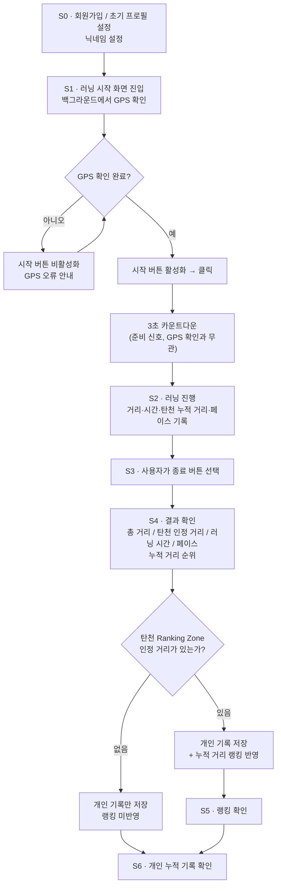

# 업무 분석 — 탄천 로컬 개인 랭킹전

> 문서: 02-workflow.md · 상태: 확정 · 열린 질문 [?] 0개 · 채택한 [제안] 0개 · 마지막 갱신: 2026-09-10
> 이 문서를 읽는 에이전트에게: 여기 없는 것은 지어내지 말고 질문으로 돌려라.
> 이 문서는 MVP 기준 핵심 사용자 흐름만 다룬다.

---

## 행위자

| A  | 이름    | 역할                          | 한 줄 상황                                                                                                                                        | 지금 쓰는 도구              |
| -- | ----- | --------------------------- | --------------------------------------------------------------------------------------------------------------------------------------------- | --------------------- |
| A1 | 탄천 러너 | 서비스의 일반 사용자                 | 성남 탄천 및 주변 지역에서 달리며 개인 러닝 기록을 관리한다. 탄천 Ranking Zone 안에서 달릴 경우 주변 러너들과 누적 거리로 경쟁하고, 랭킹에 관심이 없는 경우에도 자신의 거리·시간·페이스 기록을 누적하여 이전의 자신과 비교한다. | NRC, Strava, 스마트폰 GPS |

> 주: Ranking Zone 좌표는 시스템에 사전 설정되어 있는 것으로 취급하며, 설정 주체는 이 문서 범위 밖이다.
> 주: 페이스(S4)는 거리·시간처럼 0 처리·GPS 끊김 등의 예외 로직을 적용하지 않고 항상 단순 속력값만 표시한다.
> 주: 실시간 갱신 원칙 — 러닝 중에는 거리·시간이 실시간으로 갱신되지만, 순위는 실시간으로 갱신되지 않는다(러닝 완료 후 결과 화면·랭킹 화면에서만 확인 가능). S2의 실시간 표시(거리·시간·탄천 인정 거리)와 S4·S5의 순위 확인을 혼동하지 말 것.
> 문서 정리 이력은 [06-backlog.md](06-backlog.md)에 모아뒀다.

---

## 단계 (As-Is → To-Be)

| S  | 단계                      | 행동(As-Is)                                                    | 감정                                           | 불편                                                                              | To-Be 한 줄                                                                                                              |
| -- | ----------------------- | ------------------------------------------------------------ | -------------------------------------------- | ------------------------------------------------------------------------------- | ---------------------------------------------------------------------------------------------------------------------- |
| S0 | 회원가입 · 초기 프로필 설정        | 기존 러닝 앱은 이메일 등 번거로운 절차로 가입해야 하고, 별도의 닉네임 설정 없이 진행되는 경우가 많다.             | 빠르고 간편하게 가입해서 바로 러닝을 시작하고 싶다.        | 번거로운 가입 절차와, 닉네임이 없어 랭킹·기록에서 자신을 구분하기 어려운 점이 진입 장벽이 된다.                                           | 카카오·구글 등 소셜 로그인으로 가입한다. 가입 시 **닉네임**을 직접 설정한다(필수). 닉네임은 다른 사용자와 중복될 수 없다.                            |
| S1 | 러닝 시작                   | 기존에는 NRC·Strava 등에서 시작 버튼을 누르고 러닝 기록을 시작한다.                  | 출발 전 자세와 페이스를 준비하며 러닝을 시작하려 한다.              | GPS 신호 확보나 기술적인 로딩 과정을 그대로 기다리는 것은 러닝 시작 흐름을 끊는다.                               | **GPS 확인이 완료되어야 시작 버튼이 활성화**되고, 버튼을 누르면 **3초 카운트다운(사용자가 준비할 시간)** 후 러닝을 시작하는 흐름으로 제공한다. GPS를 사용할 수 없는 동안은 버튼이 비활성화되고 오류를 안내한다 — 네트워크가 불안정해 GPS 확인이 늦어지는 상황을 대비해 확인을 버튼 클릭보다 먼저 끝낸다.      |
| S2 | 러닝 진행                   | 사용자는 달리면서 거리·시간·페이스를 확인한다.                                   | 달리면서 현재 기록과 탄천에서의 성과가 궁금하다.           | 러닝 도중 기록을 보기 위해 계속 휴대폰을 확인하면 집중을 방해하지만, 필요해서 화면을 봤을 때 핵심 정보가 없다면 현재 상태를 알기 어렵다. | 러닝 중 화면에는 **현재 러닝 거리·러닝 시간·탄천 인정 누적 거리·페이스** 등 주요 정보를 실시간으로 표시한다(순위는 표시하지 않음).                                               |
| S3 | 러닝 종료                   | 기존 러닝 앱처럼 사용자가 러닝을 끝낸 뒤 직접 기록을 종료한다.                         | 이번 러닝을 완료했다는 성취감을 느낀다.                      | 자동 종료나 일시정지 판정이 개입하면 사용자가 의도하지 않은 시점에 세션이 나뉠 수 있다.                              | MVP에서는 **사용자가 종료 버튼을 직접 눌러 러닝을 종료**한다. 자동 종료와 일시정지는 제공하지 않는다.                                                          |
| S4 | 결과 확인 · Ranking Zone 판정 | 기존 서비스에서는 전체 러닝 거리·시간·페이스 등의 개인 기록을 확인한다.                    | 완주 기록과 함께 탄천에서 자신의 성과가 어느 정도인지 확인하고 싶다.      | 전체 러닝 기록만으로는 실제 탄천 랭킹에 어느 정도가 반영되었는지 알기 어렵다.                                    | 러닝 종료 후 **총 러닝 거리, 탄천 인정 거리, 러닝 시간, 누적 거리 기준 순위, 페이스**를 보여준다. 전체 러닝은 개인 기록으로 저장하고 Ranking Zone 안에서 측정된 거리만 랭킹에 반영한다. |
| S5 | 랭킹 확인                   | 기존 러닝 서비스의 전국·글로벌 단위 기록 비교는 내가 실제로 자주 뛰는 지역에서의 위치를 체감하기 어렵다. | 주변에서 비슷한 코스를 달리는 러너들과 경쟁하며 성취감과 동기부여를 얻고 싶다. | 전체 사용자 기반 경쟁에서는 현실적인 경쟁 상대와 자신의 위치를 파악하기 어렵다.                                   | 탄천 Ranking Zone의 **누적 거리 기준 순위**를 제공한다.                  |
| S6 | 개인 누적 기록 확인             | 기존에도 자신의 과거 러닝 기록을 확인할 수 있지만 기록이 단순한 숫자 목록으로 남는 경우가 많다.      | 다른 사용자와의 경쟁보다 자신의 성장을 확인하고 싶은 사용자도 있다.       | 탄천 밖에서 주로 달리거나 랭킹에 관심이 적은 사용자는 로컬 랭킹만으로 지속적인 동기부여를 얻기 어렵다.                      | Ranking Zone 여부와 관계없이 **개인 러닝 기록을 계속 누적하여 확인할 수 있게 한다.**                          |

---

## 흐름

---

> 검토했으나 제외한 후보는 [06-backlog.md](06-backlog.md)에 모아뒀다.

---

## 최종 워크플로우 한 줄

**사용자가 소셜 로그인과 닉네임 설정으로 가입한 뒤 3초 카운트다운으로 러닝을 시작하고, GPS로 전체 개인 기록과 탄천 Ranking Zone 거리를 측정한 뒤 직접 러닝을 종료하면 개인 기록은 지속적으로 누적되고 탄천 인정 거리는 누적 거리 기준 로컬 랭킹에 반영되어 자신의 과거 기록 및 주변 러너들과 경쟁할 수 있다.**
